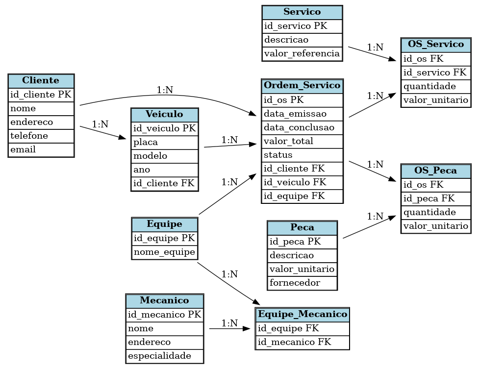

# 🔧 Sistema de Oficina Mecânica – Banco de Dados

Este repositório contém o **diagrama ERD (Entidade-Relacionamento)** para o sistema de controle e gerenciamento de **ordens de serviço** em uma oficina mecânica.

## 📖 Narrativa
- Clientes levam veículos para consertos ou revisões periódicas.  
- Cada veículo é associado a uma equipe de mecânicos, que identifica os serviços e peças necessários.  
- O cliente autoriza a execução, gerando uma **Ordem de Serviço (OS)**.  
- O valor da OS é composto pelos serviços e peças utilizados.  
- Mecânicos possuem código, nome, endereço e especialidade.  

## 🗂 Estrutura do Banco de Dados

### Entidades principais:
- **Cliente** – informações de clientes.  
- **Veiculo** – veículos pertencentes aos clientes.  
- **Ordem_Servico** – ordens de serviço emitidas.  
- **Equipe** – equipes responsáveis pelos serviços.  
- **Mecanico** – mecânicos associados às equipes.  
- **Servico** – tabela de referência de serviços de mão-de-obra.  
- **Peca** – peças utilizadas nas ordens.  

### Tabelas de relacionamento:
- **Equipe_Mecanico** – associa mecânicos às equipes (N:N).  
- **OS_Servico** – serviços associados às ordens (N:N).  
- **OS_Peca** – peças associadas às ordens (N:N).  

## 🔗 Relacionamentos
- Cliente 1 ─── N Veiculo  
- Cliente 1 ─── N Ordem_Servico  
- Veiculo 1 ─── N Ordem_Servico  
- Equipe 1 ─── N Ordem_Servico  
- Equipe N ─── N Mecanico (via *Equipe_Mecanico*)  
- Ordem_Servico N ─── N Servico (via *OS_Servico*)  
- Ordem_Servico N ─── N Peca (via *OS_Peca*)  

## 📊 Diagrama ERD

## 💾 Script SQL (DDL)
Baixe o script de criação das tabelas: [DDL.sql](DDL.sql)

## 🚀 Como usar
O modelo pode ser implementado em qualquer SGBD relacional (**MySQL, PostgreSQL, SQL Server**).  
Basta utilizar o arquivo `DDL.sql` com os scripts de criação de tabelas.  

---

👨‍💻 Desenvolvido para fins acadêmicos e profissionais.
